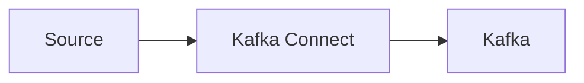
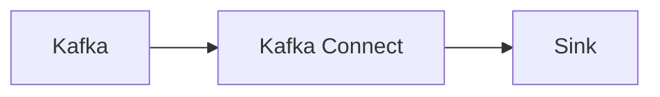
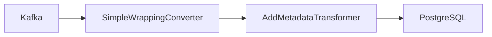

# How to stream data from Kafka to relational database

In this post I would like to show how to stream data from any Kafka topic to relational database with Kafka Connect.

<!-- truncate -->

## What is Kafka Connect ?

In short Kafka Connect is a framework facilitating streaming integrations beetwen Kafka and other systems.
You can learn more about it [here](https://developer.confluent.io/courses/kafka-connect/intro/).

There are two types of Kafka Connect workflows. One is *Source* to Kafka.

and the other on Kafka to *Sink*

where *Source* and *Sink* are  abstractions representing any external system like MongoDb, FTP, File, relational database e.g. PostgreSql, Oracle or Sql Server or even another kafka cluster.

Additionally Kafka Connect allows making data manipulations in beetwen source and sink using so called Single Message Transformers (SMT). Transformers are functions registered for any given processing task invoked on each message. You can use built in transformers but you can provide your own shipped as JVM jar bundle.

## Kafka Connect message message formats and schema

Kafka itself has no known about message payloads. For the broker message is just byte array, however Kafka Connect needs to know message format and schema in order to perform data manipulations using transformers or pour message into sink in a structurized way.

## The Problem

Confluent Kafka JdbcSinkConnector which I will be using requires that the incoming message schema is known, to be able map between message fields and sql columns.

The problem is we often lack schema or even worse: schema of the message is so complicated it's impossible to map it into flat column based sql table.

## The Solution

Fortunately modern RDBM's allow query json put in a single field, so the idea here is to simply wrap 

https://github.com/tomaszkubacki/kafka_connect_demo/blob/master/kafka_to_postgresql/kafka_to_postgres.md

