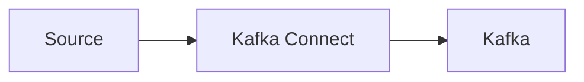
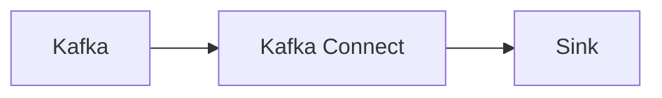

# How to stream data from Kafka to relational database

In this post I would like to show how to stream data from any topic to relational database.

<!-- truncate -->

## What is Kafka Connect

In short Kafka Connect is a framework facilitating streaming integrations beetwen Kafka and other systems.
You can learn more about it [here](https://developer.confluent.io/courses/kafka-connect/intro/).

There are two types of Kafka Conect workflows. One is *Source* to Kafka.

and the other on Kafka to *Sink*

where *Source* and *Sink* are kind of abstractions representing any external system like MongoDb, FTP, File or any relational database like PostgreSql, Oracle or Sql Server.

## Kafka Connect Plugins

## How it works

https://github.com/tomaszkubacki/kafka_connect_demo/blob/master/kafka_to_postgresql/kafka_to_postgres.md

