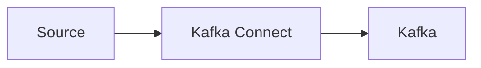
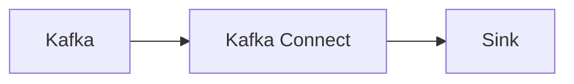
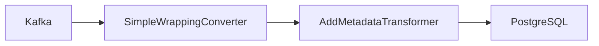

# How to stream data from Kafka to relational database

In this post I would like to show how to stream data from any text based Kafka topic into sql table using Kafka Connect.

<!-- truncate -->

## What is Kafka Connect ?

In short Kafka Connect is a framework facilitating streaming integrations beetwen Kafka and other systems.
You can learn more about it [here](https://developer.confluent.io/courses/kafka-connect/intro/).

There are two types of Kafka Connect workflows. One is *Source* to Kafka.

and the other on Kafka to *Sink*

where *Source* and *Sink* are  abstractions representing any external system like MongoDb, FTP, File, relational database e.g. PostgreSql, Oracle or Sql Server or even another kafka cluster.

Additionally Kafka Connect allows making data manipulations in beetwen source and sink using so called Single Message Transformers (SMT). Transformers are functions registered for any given processing task invoked on each message. You can use built in transformers, but you can also provide your own shipped as a JVM jar bundle.

### Kafka Connect task

Connect processing is organized in *tasks*, which could be registered and managed using REST api (e.g. add, remove, stop resume, delete).

Task configuration allows specify main 

## Kafka Connect message formats and schema

Kafka itself has no knownlege regarding message payload. For the broker message is just a byte array, however Kafka Connect needs to know message format and schema (in most cases) to perform data manipulations using transformers or pour message into sink in a structurized way.

## The Problem

Confluent Kafka JdbcSinkConnector which I will be using requires that the incoming message schema is known, to be able to map between message fields and sql columns.

The problem we often face, is lack of schema or even worse, message schema is so complicated it's impossible to map it into flat column based sql table. E.g. for json with nested arrays it's impossible to map it to column, if the array size is unknown.

## The Solution

Fortunately modern RDBM's allow query json put in a single field, so the idea here is to simply wrap the message with a single field envelope

https://github.com/tomaszkubacki/kafka_connect_demo/blob/master/kafka_to_postgresql/kafka_to_postgres.md

